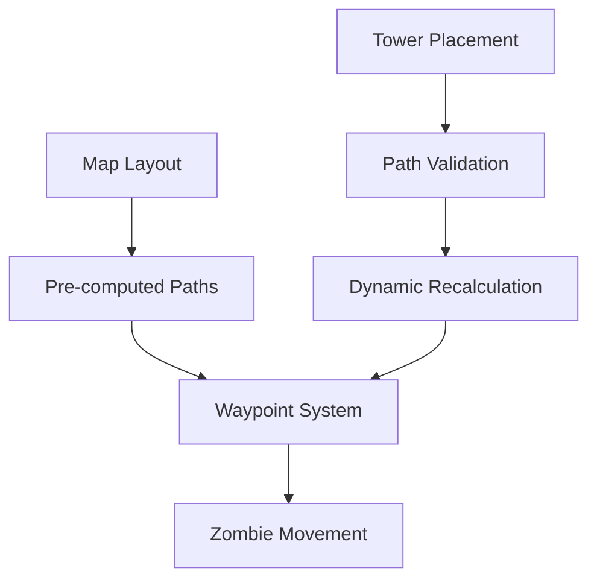

# Zombie Tower Defense Game Design Document

## Executive Summary

Zombie Tower Defense is a 2D top-down strategy game inspired by classic Command & Conquer titles, where players strategically place and upgrade towers to defend against increasingly challenging waves of zombies. Built with TypeScript and Pixi.js, the game features meaningful tower variety with rock-paper-scissors relationships, pre-computed waypoint pathfinding for efficient performance, and a balanced economic system with data-driven difficulty progression.

Key features include five distinct tower types with behavioral upgrade paths, seven zombie variants with unique counterplay requirements, active player abilities for enhanced engagement, and a comprehensive balancing framework with mathematical scaling models. The game progresses through 50+ waves with adaptive difficulty, providing both strategic depth and accessibility for casual players while maintaining competitive challenge for experienced tower defense enthusiasts.

## 1. Overview

A 2D top-down zombie tower defense game inspired by the visual style and gameplay mechanics of early Command & Conquer titles, particularly "Command & Conquer: Tiberian Sun". Players strategically place and upgrade towers to defend against increasingly challenging waves of zombies.

### 1.1 Visual Style and Inspiration
- Pixel-art inspired sprite-based graphics reminiscent of 90s RTS games
- Top-down perspective with isometric elements
- Dark, post-apocalyptic color palette with vibrant effects for combat
- UI design inspired by classic Command & Conquer interfaces
- Visual effects that emphasize combat feedback and unit clarity

### 1.2 Core Gameplay
- Defend a base against waves of zombies in a top-down perspective
- Strategically place and upgrade tower types that create meaningful tactical decisions
- Manage resources including money (earned by killing zombies) and lives (lost when zombies reach the base)
- Face diverse zombie types with rock-paper-scissors relationships requiring tactical tower selection
- Experience progressive difficulty across more than 50 waves with increasing challenge
- Master tower synergies and positioning for optimal defensive strategies
- Utilize active player abilities to influence battle outcomes
- Make real-time tactical decisions during wave progression
- Develop towers through meaningful upgrade paths that change behavior, not just statistics

### 1.2 Game States
- **MainMenu**: Initial game state with options
- **Playing**: Active gameplay state
- **Paused**: Temporarily suspended gameplay
- **WaveComplete**: Between wave state with rewards
- **GameOver**: End game state with score summary
- **Victory**: Win condition achieved state

### 1.3 Progression System
- 50+ waves with increasing difficulty
- Unlockable tower types
- Achievement system for gameplay milestones
- Score-based ranking system
- Difficulty modes (Easy, Normal, Hard, Nightmare)
- Campaign mode with multiple maps
- Tower unlock conditions based on wave completion
- Special zombie types unlocked at specific wave milestones

### 1.4 Project Structure
- **Z_TD/**: Main project directory generated with `npm create pixi.js@latest`
- **src/**: TypeScript source files
- **public/**: Static assets (images, sounds)
- **index.html**: Main HTML entry point
- **vite.config.ts**: Vite configuration file

### 1.5 Architectural Principles and Performance Features
The game is built with several key architectural principles and performance optimizations:

#### Clean Architecture
- Follows SOLID principles for maintainable code
- Separation of concerns between game logic, rendering, and UI
- Dependency injection for loose coupling between systems

#### Performance Optimizations
- **Object Pooling**: Reuse of game objects (zombies, projectiles, particles, corpses) to minimize garbage collection
- **Pre-computed Waypoints**: Low-cost pathfinding with minimal runtime calculation
- **Spatial Partitioning**: Optimized collision detection
- **Direct Object Updates**: Objects update themselves without system orchestration

#### Design Framework
- **Balanced Economy**: Mathematical relationship between income, costs, and progression
- **Scalable Difficulty**: Defined formulas for zombie progression and wave composition
- **Player Agency**: Active abilities that enhance engagement beyond tower placement

### 1.6 Technology Stack
- **Game Engine**: Pixi.js 7.x
- **Language**: TypeScript
- **Build Tool**: Vite (instant dev server startup, ES module support, 20-30x faster TypeScript transpilation)
- **Project Template**: Z_TD template generated with `npm create pixi.js@latest`
- **UI Framework**: Vanilla TypeScript with Pixi.js UI components
- **Audio**: Howler.js (future implementation)
- **Architecture**: Composition-based design with Pixi.js integration
- **State Management**: Direct state modification with observer patterns
- **Performance**: Object pooling for particles and entities

### 1.7 Development Environment
- **Setup**: `cd Z_TD && npm install && npm run dev`
- **Hot Module Replacement**: Instant feedback during development
- **Production Builds**: Rollup optimization with tree shaking
- **Minimal Configuration**: Zero-config approach

### 1.8 Development Workflow
1. **Initialize**: `npm create pixi.js@latest` to generate project template
2. **Install**: `npm install` to install dependencies
3. **Develop**: `npm run dev` to start development server
4. **Lint**: `npm run lint` to check code quality
5. **Build**: `npm run build` to create production build
6. **Test**: Run unit and integration tests

## 2. Architecture

### 2.1 Core Design Principles

#### 2.1.1 Single Responsibility Principle
Each class handles one specific concern:
- `GameManager`: Game state and flow control
- `WaveManager`: Zombie wave spawning logic
- `TowerManager`: Tower placement and behavior
- `ObjectPoolManager`: Resource recycling
- `ParticleManager`: Visual effects coordination

#### 2.1.2 Separation of Concerns
Different aspects of the game are handled in different places:
- Data with behavior
- Game logic with rendering logic
- Input handling with business rules
- UI code with core gameplay

#### 2.1.3 Composition Over Inheritance
Game objects are built using component composition rather than deep class hierarchies:
- `Transform`: Position, rotation, scale
- `Health`: HP management
- `Movement`: Path following and motion
- `Rendering`: Visual representation
- `Combat`: Damage dealing/receiving

#### 2.1.4 Dependency Injection
Systems depend on interfaces, not concrete implementations:
- `IPoolManager` for object recycling
- `IPathfinder` for flow field navigation
- `IRenderer` for visual output

### 2.2 System Architecture

#### 2.2.1 Simplified State Management
The game uses direct state modification with observer patterns for UI updates:
- Game objects modify state directly rather than through action dispatch
- UI components observe state changes through event listeners
- Managers coordinate between different game systems
- Direct method calls replace complex state propagation

#### 2.2.2 Composition-Based Pixi Integration
The game uses a composition-based approach that integrates with Pixi.js:
- Game objects extend Pixi Containers directly
- Behavior components are attached to objects for specific functionality
- Objects update themselves rather than being processed by external systems
- Pixi rendering is managed through direct property synchronization

#### 2.2.3 Development Tooling
Optimizing the development workflow:
- **Instant Server Startup**: No matter the project size
- **Native ES Modules**: Perfect compatibility with Pixi.js imports
- **Fast TypeScript Transpilation**: 20-30x faster than vanilla tsc using esbuild
- **Hot Module Replacement**: Real-time code updates without page refresh
- **Production Optimization**: Rollup bundling with tree shaking for efficient builds

### 2.3 Source Code Organization

#### 2.3.1 Directory Structure
```
src/
├── objects/           # Game objects (towers, zombies, projectiles)
├── components/        # Behavior components
├── managers/          # Game managers (wave, tower, resource)
├── utils/             # Utility functions and helpers
├── ui/                # UI components
├── assets/            # Game assets management
├── config/            # Game configuration and constants
└── main.ts           # Application entry point
```

#### 2.3.2 Module Organization
- **Modular Design**: Each feature is encapsulated in its own module
- **Lazy Loading**: Heavy modules loaded only when needed
- **Type Safety**: Full TypeScript typing throughout
- **ES Module Imports**: Native ES module support

## 3. Component Architecture

### 3.1 Composition-Based Object Design

#### 3.1.1 Base Object Structure
Game objects are the fundamental elements in the game world:
- Extend Pixi.js Containers directly for rendering integration
- Attach behavior components that define their functionality
- Update themselves rather than being processed by external systems
- Communicate with other objects through direct method calls

#### 3.1.2 Core Components
| Component | Responsibility | Used By | Pixi Integration |
|-----------|---------------|---------|-------------------|
| `TransformComponent` | Position, rotation, scale | All objects | Syncs with Container transform |
| `HealthComponent` | HP, damage resistance | Zombies, towers | No direct sync |
| `MovementComponent` | Path following and motion | Zombies, projectiles | Updates Container position |
| `RenderComponent` | Sprite, animation | All visible objects | Creates/manages Pixi sprites |
| `CombatComponent` | Damage, attack range | Towers, zombies | No direct sync |
| `PoolableComponent` | Object pooling metadata | Pooled objects | Manages Container lifecycle |
| `PhysicsComponent` | Collision, physics body | Moving objects | Integrates with Pixi graphics |

### 3.2 Object Behavior Implementation

#### 3.2.1 Movement Behavior
Handles object movement using pre-computed waypoint paths:
- Objects with MovementComponent follow predefined waypoints
- Direct position updates rather than system processing
- Integrated obstacle detection through component communication

#### 3.2.2 Combat Behavior
Manages combat interactions between objects with realistic damage mechanics:

##### 3.2.2.1 Damage Calculation
- Base damage modified by distance falloff
- Armor mitigation for tank-type zombies
- Type effectiveness based on tower-zombie counter relationships
- Critical hit chance for high-damage towers
- Damage over time effects for flame towers
- Special resistance/weakness multipliers for zombie types

##### 3.2.2.2 Combat Resolution
- Collision detection between projectiles and zombies
- Damage application with visual feedback
- Knockback effects for high-damage attacks
- Status effects (slow, burn, shock)

#### 3.2.3 Render Behavior
Manages object rendering through direct Pixi.js integration:
- Objects update their own visual properties
- Component-based sprite management
- Batch rendering optimizations
- Direct synchronization with Pixi display objects

##### 3.2.2.3 Death and Rewards
- Corpse creation for visual persistence
- Resource rewards based on zombie type
- Particle effects for death animations
- Score attribution for kills

#### 3.2.3 Render System
Synchronizes ECS components with Pixi.js rendering:
- Processes entities with RenderComponent
- Updates sprite properties based on component data
- Manages sprite lifecycle

## 4. Game Systems

### 4.1 Wave System
Manages the progression of zombie waves with increasing difficulty:

### 4.1.1 Wave Composition
- Each wave consists of multiple zombie groups with varying types
- Zombie types include:
  - **Basic zombies**: Slow but numerous, vulnerable to high fire rate
  - **Fast zombies**: Higher speed, lower health, resistant to slow effects
  - **Tank zombies**: High health, slow speed, resistant to single-target damage
  - **Armored zombies**: High damage resistance, vulnerable to armor-piercing
  - **Swarm zombies**: Weak individually but deadly in groups
  - **Stealth zombies**: Partially invisible, require detection towers
  - **Mechanical zombies**: Resistant to fire, vulnerable to EMP effects
- Wave composition creates rock-paper-scissors scenarios that require tactical tower selection

### 4.1.2 Spawn Timing
- Zombies spawn at defined intervals within each wave
- Pause periods between waves for player preparation
- Dynamic spawn rates based on player performance

### 4.1.3 Difficulty Progression

#### Mathematical Scaling Framework

##### Core Scaling Formulas
- **Health Scaling**: Base health + (wave_number × 1.8) × health_multiplier
- **Damage Scaling**: Base damage + (wave_number × 1.5) × damage_multiplier
- **Spawn Rate**: Base spawn interval × (0.95^wave_number) with minimum 0.5 seconds
- **Zombie Count**: Base count × (1.08^wave_number) with 20% spikes every 5 waves
- **Speed Scaling**: Base speed + (wave_number × 0.05) with maximum caps

##### Wave Composition Data Model
| Wave Range | Basic | Fast | Tank | Armored | Swarm | Stealth | Mechanical |
|------------|-------|------|------|---------|-------|---------|------------|
| 1-5        | 80%   | 20%  | 0%   | 0%      | 0%    | 0%      | 0%         |
| 6-10       | 60%   | 30%  | 10%  | 0%      | 0%    | 0%      | 0%         |
| 11-15      | 50%   | 30%  | 15%  | 5%      | 0%    | 0%      | 0%         |
| 16-20      | 40%   | 25%  | 20%  | 10%     | 5%    | 0%      | 0%         |
| 21-25      | 35%   | 20%  | 20%  | 15%     | 5%    | 5%      | 0%         |
| 26-30      | 30%   | 15%  | 20%  | 20%     | 10%   | 5%      | 5%         |
| 31-35      | 25%   | 15%  | 15%  | 20%     | 15%   | 5%      | 5%         |
| 36-40      | 20%   | 10%  | 15%  | 20%     | 15%   | 10%     | 10%        |
| 41-50+     | 15%   | 10%  | 10%  | 20%     | 20%   | 15%     | 10%        |

##### Adaptive Difficulty System
- **Performance Metrics**: Kill rate, resource efficiency, lives lost per wave
- **Adjustment Triggers**: 
  - Below 70% kill rate: Reduce next wave zombie count by 15%
  - Above 90% kill rate: Increase next wave zombie count by 10%
  - Lives lost > 3: Insert easier bonus wave before next regular wave
- **Scaling Modifiers**: 
  - Fast track players: +5% difficulty if consistently above 95% performance
  - Struggling players: -10% difficulty if below 60% performance for 3 consecutive waves
- **Recovery Mechanisms**: 
  - Safety waves (25% reduced difficulty) after losing >5 lives in single wave
  - Resource windfall (200 money) after 2 consecutive failed waves

### 4.2 Tower System
Handles tower placement, upgrading, and behavior with multiple tower types:

#### 4.2.1 Tower Types

##### Machine Gun Tower
- **Role**: Anti-swarm specialist
- **Strengths**: High fire rate, moderate damage, good against basic zombies
- **Weaknesses**: Poor against armored targets, limited range
- **Strategic Position**: Best in chokepoints where zombies are forced into tight groups
- **Zombie Counter**: Excellent against basic zombies, poor against tanks
- **Synergy**: Works well with slowing towers to increase damage uptime

##### Sniper Tower
- **Role**: Anti-tank specialist
- **Strengths**: High single-target damage, long range, armor-piercing capability
- **Weaknesses**: Slow fire rate, ineffective against fast-moving targets
- **Strategic Position**: Backline placement to engage high-value targets safely
- **Zombie Counter**: Excellent against tank zombies, poor against fast zombies
- **Synergy**: Pairs well with detection towers that reveal stealth zombies

##### Shotgun Tower
- **Role**: Area control specialist
- **Strengths**: Multiple target hits, high damage at close range, good crowd control
- **Weaknesses**: Very short range, low damage per individual target
- **Strategic Position**: Ideal for narrow passages and corners where zombies cluster
- **Zombie Counter**: Excellent against grouped zombies, poor against spread formations
- **Synergy**: Enhanced by slowing effects that keep zombies in range longer

##### Flame Tower
- **Role**: Status effect specialist
- **Strengths**: Area damage over time, burning effect slows enemies, affects groups
- **Weaknesses**: Damage decreases over time, less effective against resistant zombies
- **Strategic Position**: Central placement to affect multiple paths
- **Zombie Counter**: Good against most zombie types except fire-resistant variants
- **Synergy**: Combines well with other damage towers for stacked effects

##### Tesla Tower
- **Role**: Chain damage specialist
- **Strengths**: Chains between multiple targets, good against clustered enemies
- **Weaknesses**: Decreasing damage per chain, requires conductive targets
- **Strategic Position**: Mid-range placement where multiple enemies can be chained
- **Zombie Counter**: Excellent against metal zombies, poor against insulated variants
- **Synergy**: Amplified by grouping towers that force enemies together

#### 4.2.2 Placement System
- Towers can only be placed on designated areas
- Visual feedback for valid/invalid placement positions
- Placement cost deducted from player resources
- Towers cannot be placed on paths or other towers

#### 4.2.3 Upgrade System
- Two strategic upgrade paths per tower type that enhance core functionality:
  - **Specialization Path**: Enhances the tower's primary strategic role
  - **Utility Path**: Adds complementary abilities or improves versatility
- Upgrade costs increase with each level
- Maximum upgrade level: 3 per path
- Unique abilities unlocked at higher levels that change tactical options

##### 4.2.3.1 Example Upgrade Paths

###### Machine Gun Tower
- **Specialization Path** (Rapid Fire):
  - Level 1: +50% fire rate
  - Level 2: Chain hit capability (bullets can hit 2 additional targets)
  - Level 3: Suppression effect (slows hit zombies by 30% for 3 seconds)
- **Utility Path** (Long Range):
  - Level 1: +30% range
  - Level 2: Bullet penetration (can pierce through 2 zombies)
  - Level 3: Tracer rounds (reveals stealth zombies in range for 5 seconds)

###### Sniper Tower
- **Specialization Path** (Armor Piercing):
  - Level 1: +40% damage to armored targets
  - Level 2: Critical hit chance (15% chance for 3x damage)
  - Level 3: Explosive rounds (30% AoE damage to nearby zombies)
- **Utility Path** (Multi-Target):
  - Level 1: Faster target acquisition (+50% target switching speed)
  - Level 2: Dual shot (fires at 2 targets simultaneously)
  - Level 3: Tracking shots (slight homing capability)

###### Shotgun Tower
- **Specialization Path** (Buckshot):
  - Level 1: +3 pellet count
  - Level 2: Spread control (20% tighter spread)
  - Level 3: Knockback effect (pushes zombies back 20 pixels)
- **Utility Path** (Support):
  - Level 1: +20% range
  - Level 2: Stun effect (1 second stun with 25% chance)
  - Level 3: Healing pulse (restores 5% health to nearby towers every 10 seconds)

###### Flame Tower
- **Specialization Path** (Inferno):
  - Level 1: +40% burn damage
  - Level 2: Extended duration (+3 seconds)
  - Level 3: Spreading fire (burning zombies have 30% chance to ignite nearby zombies)
- **Utility Path** (Area Control):
  - Level 1: +25% radius
  - Level 2: Chain fire (burning spreads to adjacent areas)
  - Level 3: Firestorm (periodic area damage pulses)

###### Tesla Tower
- **Specialization Path** (Lightning Storm):
  - Level 1: +3 chain count
  - Level 2: Reduced damage falloff (only 10% per chain)
  - Level 3: Lightning rod (attracts chain effects to mechanical zombies)
- **Utility Path** (EMP):
  - Level 1: Chain through barriers (25% effectiveness)
  - Level 2: EMP effect (slows mechanical zombies by 50% for 5 seconds)
  - Level 3: Overload (chain effects disable zombie abilities for 3 seconds)

#### 4.2.3.2 Tower Synergies
- **Slowing + High Damage**: Slowing towers increase damage uptime for high-damage towers
- **Detection + Sniper**: Detection towers reveal stealth zombies for sniper elimination
- **Area Control + Support**: Shotgun towers control space while support towers enhance others
- **Chain Starter + Chain Extender**: Tesla towers create chain reactions when zombies are grouped
- **Status Effect Stacking**: Flame and electric effects can stack for increased damage

### 4.3 Resource System
Manages player resources with balanced economy mechanics:

#### 4.3.1 Resource Types
- **Money**: Primary currency for tower placement and upgrades
  - Base value: 15 money per basic zombie kill
  - Tier-based rewards: Stronger zombies worth more (30-75 money)
  - Multipliers: 1.5x for consecutive kills within 3 seconds
  - Interest: 3% per wave on money above 150
  - Wave completion bonus: 100-300 money based on performance
- **Lives**: Player health that decreases when zombies reach the end
  - Starts with 20 lives
  - Loses 1 life per zombie that reaches the end
  - Game over when lives reach zero
- **Score**: Performance metric based on various factors
  - Zombie kills (10-50 points per type)
  - Waves completed (100 points per wave)
  - Money earned (1 point per 10 money)
  - Lives remaining (50 points per life at victory)

#### 4.3.2 Resource Management
- Real-time updates to UI elements
- Visual feedback for resource gains/losses
- Resource modifiers based on difficulty
- Bonus rewards for efficient wave completion

#### 4.3.3 Economic Balance Framework

##### Resource Generation Model
- **Base Income**: 20 money per basic zombie × zombie count per wave
- **Tier Multiplier**: Stronger zombies worth 2× (fast), 3× (tank), 4× (armored), 5× (special)
- **Efficiency Bonus**: 1.5× for >80% kill rate, 2× for >95% kill rate
- **Interest Formula**: 5% per wave on money above 200, capped at 100 per wave
- **Completion Bonus**: 150 + (10 × wave_number) money for completing waves
- **Scaling Income**: Base income increases by 8% every 10 waves

##### Cost Scaling Model
- **Tower Costs**: Base cost + (tier × 20) where tier 1=60, tier 2=80, tier 3=100, tier 4=120
- **Upgrade Costs**: Base upgrade cost + (upgrade_level × 40) + (tower_tier × 20)
- **Late-game Adjustment**: Costs increase by 1.5% per 10 waves after wave 30
- **Affordability Cap**: Maximum tower cost capped at 180 money, upgrades at 140 money

##### Progression Balance
- **Early Game** (Waves 1-15): Affordable towers with basic upgrades
- **Mid Game** (Waves 16-30): Strategic choices between tower types and quality upgrades
- **Late Game** (Waves 31+): Focus on optimization and synergy rather than raw power
- **Catch-up Mechanism**: Players behind receive 1.3× income until they catch up
- **Power Creep Management**: Late-game content emphasizes strategy over statistics

##### Economic Tension Points
- **Opportunity Cost**: Choosing between multiple towers vs. upgrading existing ones
- **Risk Management**: Spending on expensive towers vs. saving for emergencies
- **Timing Decisions**: When to upgrade vs. when to save for next wave
- **Positional Value**: High-value placements that justify expensive investments

### 4.4 Progression System

#### 4.4.1 Tower Unlock Progression
- **Machine Gun Tower**: Available from start
- **Sniper Tower**: Unlocked after completing wave 5
- **Shotgun Tower**: Unlocked after completing wave 10
- **Flame Tower**: Unlocked after completing wave 15
- **Tesla Tower**: Unlocked after completing wave 20

#### 4.4.2 Long-term Player Goals

- **Wave Completion**: Survive all 50+ waves on each difficulty
- **Tower Mastery**: Fully upgrade all tower types on all paths
- **Efficiency Records**: Complete waves with high kill rates and resource efficiency
- **Achievement Challenges**: Complete special challenge conditions (e.g., "Win without placing more than 10 towers")
- **Score Pursuit**: Achieve high scores on leaderboards
- **Difficulty Completion**: Beat the game on all difficulty levels
- **Map Mastery**: Complete all campaign maps with gold ratings

#### 4.4.3 Achievement System

- **Completionist Achievements**: Unlock all towers, complete all waves
- **Skill-based Achievements**: High scores, efficiency ratings, kill streaks
- **Challenge Achievements**: Special conditions (e.g., "Beat wave 20 with only Machine Gun towers")
- **Milestone Achievements**: Wave completion markers (10, 25, 50 waves)

### 4.5 Object Pooling System
Optimizes performance through object reuse with pre-allocated object pools:

#### 4.4.1 Pool Types
- **Zombie Pool**: Manages active and inactive zombie entities
- **Projectile Pool**: Handles tower projectiles and effects
- **Particle Pool**: Manages visual effect particles
- **Corpse Pool**: Handles persistent zombie remains

#### 4.4.2 Pool Management
- Pre-allocated capacity based on maximum expected concurrent objects
- Automatic pool expansion when capacity is exceeded
- Object lifecycle management (initialize, reset, activate, deactivate)
- Memory-efficient storage using typed arrays where possible

#### 4.4.3 Performance Benefits
- Eliminates instantiation overhead during gameplay
- Reduces garbage collection frequency
- Maintains consistent frame rates during intense battles
- Minimizes memory allocation fragmentation

## 5. Pathfinding and AI

### 5.1 Pre-computed Waypoint Paths
Zombies navigate using pre-computed waypoint paths, a proven approach used in most successful tower defense games. This provides efficient and predictable movement while maintaining simplicity appropriate for the game scope:

### 5.3 Map Design Framework

#### 5.3.1 Terrain Types
The game features multiple terrain types that affect gameplay:

- **Grass**: Standard terrain with no movement or combat modifiers
- **Concrete**: Slightly faster movement speed for zombies, no combat modifiers
- **Water**: Zombies cannot traverse, creates natural boundaries
- **Forest**: Provides natural cover for zombies (50% visibility reduction)
- **Ruins**: Partial cover terrain that affects line of sight
- **Road**: Pre-defined paths for zombie movement with slightly faster movement

#### 5.3.2 Path Layout Design

- **Multiple Route Options**: Each map provides 2-3 distinct paths to the player base
- **Path Complexity**: Paths include straight sections, curves, and branching points
- **Variable Width**: Paths vary in width to create different tactical opportunities
- **Elevation Changes**: Some paths have elevation changes that affect range and visibility

#### 5.3.3 Chokepoint Design Principles

- **Natural Chokepoints**: Narrow passages that force zombies into tight groups
- **Artificial Chokepoints**: Areas where towers can be placed to create defensive bottlenecks
- **Layered Defense Points**: Multiple chokepoints along each path for strategic depth
- **Visibility Control**: Chokepoints designed to maximize tower coverage area

#### 5.3.4 Map Variety

- **Urban Maps**: Dense building layouts with multiple tight chokepoints
- **Rural Maps**: Open areas with fewer but longer paths
- **Industrial Maps**: Complex layouts with multiple elevation levels
- **Mixed Terrain Maps**: Combination of different terrain types for varied gameplay



#### 5.1.1 Path Design
- **Multiple Route Options**: 2-3 distinct paths for strategic depth
- **Waypoint Markers**: Pre-defined positions that guide zombie movement
- **Smooth Interpolation**: Natural movement between waypoints
- **Path Validation**: Check for tower obstructions

#### 5.1.2 Dynamic Obstacle Handling
- **Simple Obstruction Detection**: Check if towers block waypoints
- **Basic Recalculation**: Compute new path only when necessary
- **Fallback Behavior**: Zombies follow adjacent navigable cells when blocked
- **Efficient Updates**: Minimal recalculation when towers are placed/removed

#### 5.1.3 Implementation Benefits
- **Low Computational Cost**: Pre-computed paths require minimal processing
- **Predictable Behavior**: Players can anticipate zombie movement
- **Easy Debugging**: Simple system with few failure points
- **Scalable Performance**: Handles large zombie hordes efficiently

#### 5.1.4 Zombie Movement
- Follow pre-defined waypoints to player base
- Simple steering behavior for natural movement
- Local avoidance for zombie-to-zombie collisions
- Minimal computational overhead
- Efficient group movement with shared path data
- Smooth transitions between waypoints
- Velocity-based interpolation for fluid motion

### 5.2 Zombie AI Behavior
Zombies exhibit simple but effective AI with type-specific behaviors that create tactical challenges:

#### 5.2.1 Basic Zombie Behavior
- Follow waypoints to player base
- Basic obstacle avoidance
- Simple damage reaction (flinch animation)
- Vulnerable to high fire rate towers

#### 5.2.2 Fast Zombie Behavior
- Higher movement speed
- Reduced health pool
- Immune to slowing effects
- Can bypass weak towers
- Requires high-damage or multi-hit towers

#### 5.2.3 Tank Zombie Behavior
- High health pool
- Slow movement speed
- Damage resistance to non-piercing attacks
- Attracts multiple towers
- Vulnerable to armor-piercing and high-damage attacks

#### 5.2.4 Armored Zombie Behavior
- Moderate speed with high damage resistance
- Requires specialized anti-armor towers
- Creates bottleneck challenges for players

#### 5.2.5 Swarm Zombie Behavior
- Weak individually but travel in large groups
- Overwhelm single-target towers

## 6. Map Design Framework

### 6.1 Terrain Types
The game features multiple terrain types that affect gameplay:

- **Grass**: Standard terrain with no movement or combat modifiers
- **Concrete**: Slightly faster movement speed for zombies, no combat modifiers
- **Water**: Zombies cannot traverse, creates natural boundaries
- **Forest**: Provides natural cover for zombies (50% visibility reduction)
- **Ruins**: Partial cover terrain that affects line of sight
- **Road**: Pre-defined paths for zombie movement with slightly faster movement

### 6.2 Path Layout Design

- **Multiple Route Options**: Each map provides 2-3 distinct paths to the player base
- **Path Complexity**: Paths include straight sections, curves, and branching points
- **Variable Width**: Paths vary in width to create different tactical opportunities
- **Elevation Changes**: Some paths have elevation changes that affect range and visibility

### 6.3 Chokepoint Design Principles

- **Natural Chokepoints**: Narrow passages that force zombies into tight groups
- **Artificial Chokepoints**: Areas where towers can be placed to create defensive bottlenecks
- **Layered Defense Points**: Multiple chokepoints along each path for strategic depth
- **Visibility Control**: Chokepoints designed to maximize tower coverage area

### 6.4 Map Variety

- **Urban Maps**: Dense building layouts with multiple tight chokepoints
- **Rural Maps**: Open areas with fewer but longer paths
- **Industrial Maps**: Complex layouts with multiple elevation levels
- **Mixed Terrain Maps**: Combination of different terrain types for varied gameplay

## 7. Progression System

### 7.1 Tower Unlock Progression
- **Machine Gun Tower**: Available from start
- **Sniper Tower**: Unlocked after completing wave 5
- **Shotgun Tower**: Unlocked after completing wave 10
- **Flame Tower**: Unlocked after completing wave 15
- **Tesla Tower**: Unlocked after completing wave 20

### 7.2 Long-term Player Goals

- **Wave Completion**: Survive all 50+ waves on each difficulty
- **Tower Mastery**: Fully upgrade all tower types on all paths
- **Efficiency Records**: Complete waves with high kill rates and resource efficiency
- **Achievement Challenges**: Complete special challenge conditions (e.g., "Win without placing more than 10 towers")
- **Score Pursuit**: Achieve high scores on leaderboards
- **Difficulty Completion**: Beat the game on all difficulty levels
- **Map Mastery**: Complete all campaign maps with gold ratings

### 7.3 Achievement System

- **Completionist Achievements**: Unlock all towers, complete all waves
- **Skill-based Achievements**: High scores, efficiency ratings, kill streaks
- **Challenge Achievements**: Special conditions (e.g., "Beat wave 20 with only Machine Gun towers")
- **Milestone Achievements**: Wave completion markers (10, 25, 50 waves)- Require area-effect solutions

#### 5.2.6 Stealth Zombie Behavior
- Partially invisible to standard towers
- Require detection towers to reveal
- Create planning challenges for players

#### 5.2.7 Mechanical Zombie Behavior
- Resistant to fire and elemental effects
- Vulnerable to EMP and electric attacks
- Specialized counterplay requirements

## 6. Visual Effects and Performance

### 6.1 Particle System
Enhances visual feedback with particle effects using object pooling:

#### 6.1.1 Particle Types
- Blood splatter effects when zombies are damaged
- Explosion effects for tower attacks
- Muzzle flash effects for tower firing
- Environmental effects for atmosphere (wind, debris)

#### 6.1.2 Particle Management
- GPU-accelerated rendering through Pixi.js
- Automatic cleanup after lifespan expiration
- LOD (Level of Detail) based on distance from camera
- Batch rendering for improved performance

### 6.2 Object Pooling Implementation
Performance optimization through object reuse:
- Pre-allocates frequently created objects
- Eliminates expensive instantiation operations
- Reduces memory fragmentation
- Configurable pool sizes based on game difficulty

### 6.3 Corpse Management
Handles persistent visual elements after zombie deaths:
- Corpses remain visible to show battle progress
- Managed through object pooling for performance
- Gradually fade or are removed over time
- Physics-based falling and settling animations

### 6.4 Performance Optimizations
Additional techniques to maintain smooth gameplay:

#### 6.4.1 Rendering Optimizations
- Viewport culling for off-screen entities
- Level of detail scaling for distant objects
- Sprite batching for similar objects
- Texture atlas usage to reduce draw calls

#### 6.4.2 Update Optimizations
- Fixed timestep updates for consistent physics
- Spatial partitioning for collision detection
- Lazy evaluation for non-critical systems
- Delta time scaling for frame rate independence

## 6.5 Player Agency and Active Abilities

### 6.5.1 Active Player Abilities
To enhance engagement beyond passive tower defense, players can use limited-use abilities:

#### Wave Control Abilities
- **Pause Wave**: Temporarily stop zombie spawning (1 use per wave)
- **Speed Up**: Increase zombie movement speed for faster wave completion (1 use per wave)
- **Call Reinforcements**: Summon temporary ally towers (3 uses per game)

#### Combat Abilities
- **Nuke**: Instantly kill 25% of visible zombies (2 uses per game)
- **Freeze**: Slow all zombies for 10 seconds (3 uses per game)
- **EMP Burst**: Disable mechanical zombies temporarily (2 uses per game)

#### Strategic Abilities
- **Resource Windfall**: Instant money bonus (1 use per 5 waves)
- **Tower Overcharge**: Temporarily boost all tower damage (2 uses per game)
- **Recall**: Sell and refund a tower with full value (3 uses per game)

### 6.5.2 Ability Economy
- Abilities unlocked through wave progression
- Limited charges to maintain strategic decision-making
- Cooldown periods to prevent spamming
- Risk/reward balance encouraging tactical use

## 7. UI/UX Design

### 7.1 Game HUD
Displays critical game information with intuitive design:

#### 7.1.1 Resource Display
- Money counter with visual currency icon
- Lives counter with heart icons
- Score display with ranking indicator
- Animated feedback for resource changes

#### 7.1.2 Wave Information
- Current wave number and name
- Zombies remaining in wave
- Progress bar for wave completion
- Next wave preview with composition

#### 7.1.3 Game Controls
- Pause/resume button
- Game speed controls (1x, 2x, 3x)
- Settings menu access
- Restart/new game options

### 7.2 Tower Selection System
Allows players to choose and place towers with intuitive interface:

#### 7.2.1 Tower Selection Panel
- Grid-based layout showing all available towers
- Visual icons representing each tower type
- Cost display for each tower
- Disabled state for unaffordable towers

#### 7.2.2 Placement Mechanics
- Click to select tower, then click on map to place
- Real-time preview of tower range
- Color-coded feedback for valid (green) and invalid (red) placement
- Right-click or escape to cancel placement

#### 7.2.3 Tower Information
- Stats display on hover (damage, range, fire rate)
- Upgrade path preview
- Sell value calculation
- Special ability descriptions

### 7.3 Wave Control Interface
Provides player control over wave progression:
- Start next wave button
- Pause/resume functionality
- Wave information display

## 8. Testing Strategy

### 8.1 Unit Testing
Individual components and objects are tested in isolation:
- Component behavior validation using Jest
- Object update logic verification with mock objects
- State management testing with direct modification patterns
- Damage calculation accuracy tests

### 8.2 Integration Testing
Testing interactions between objects and components:
- Component integration with object lifecycle tests
- State management flow with observer pattern tests
- UI and game logic synchronization with event-driven tests
- Pathfinding integration with obstacle placement scenarios

### 8.3 Performance Testing
Ensuring smooth gameplay experience:
- Frame rate consistency under load with 100+ zombies
- Memory usage optimization with long gameplay sessions
- Object pool efficiency validation with high spawn rates
- Pathfinding performance with dynamic obstacles

### 8.4 Balance Testing
Validating economic and difficulty frameworks:
- **Economic Balance Validation**: Income vs. expense ratios across difficulty levels
- **Upgrade Path Testing**: Effectiveness and cost efficiency of all upgrade trees
- **Difficulty Scaling Verification**: Mathematical formulas validated through playtesting
- **Adaptive Difficulty Testing**: Performance tracking and adjustment mechanisms

### 8.5 Playtesting Protocol
Systematic evaluation with real players:

#### 8.5.1 Testing Metrics
- **Completion Rates**: Percentage of players completing waves 10, 25, 50
- **Engagement Time**: Average session length and retention rates
- **Difficulty Perception**: Player feedback on challenge levels
- **Upgrade Usage**: Frequency and effectiveness of different upgrade paths
- **Economic Decisions**: Tower placement and upgrade timing choices

#### 8.5.2 Playtesting Stages
- **Alpha Testing**: Internal testing of core mechanics and balance
- **Beta Testing**: External testing with diverse player groups
- **Iterative Testing**: Regular sessions during development for balance updates
- **Post-Launch Testing**: Ongoing evaluation for content updates

#### 8.5.3 Data Collection Methods
- **Telemetry**: Automatic collection of gameplay statistics
- **Surveys**: Player feedback on difficulty and enjoyment
- **Observation**: Direct monitoring of player behavior and decision-making
- **A/B Testing**: Comparing different balance configurations

### 8.6 Development Tooling Testing
Ensuring efficient development tooling:
- **Hot Module Replacement Testing**: Verify state persistence during HMR
- **ES Module Testing**: Ensure proper module imports and exports
- **TypeScript Transpilation Testing**: Validate type safety with fast transpilation
- **Production Build Testing**: Verify optimization and tree shaking

## 9. Recommendations and Future Considerations

### 9.1 Technical Recommendations
- **Performance Targets**: Establish specific performance benchmarks (e.g., maintain 60 FPS with 200+ concurrent zombies)
- **Memory Management**: Define memory usage limits and garbage collection strategies
- **Scalability Testing**: Plan for testing with increasing entity counts to validate pathfinding efficiency
- **Cross-browser Compatibility**: Ensure consistent performance across major browsers

### 9.2 Balancing Considerations
- **Economic Balance Testing**: Validate income vs. expense ratios across difficulty levels
- **Difficulty Curve Validation**: Test mathematical scaling formulas with playtesting
- **Ability Power Creep**: Monitor active abilities to prevent overpowered combinations
- **Progression Pacing**: Ensure difficulty spikes match player adaptation time

### 9.2 Feature Enhancements
- **Advanced Tower Types**: Consider additional tower types with unique mechanics
- **Environmental Interactions**: Add destructible environment elements that affect pathfinding
- **Multiplayer Considerations**: Design systems with potential multiplayer expansion in mind
- **Modding Support**: Structure code to allow community-created content

### 9.3 Development Process Improvements
- **Automated Performance Testing**: Implement continuous performance monitoring
- **Visual Regression Testing**: Use tools like Percy for UI consistency
- **Integration with CI/CD**: Automate testing and deployment processes
- **Documentation Generation**: Use tools like TypeDoc for automatic API documentation