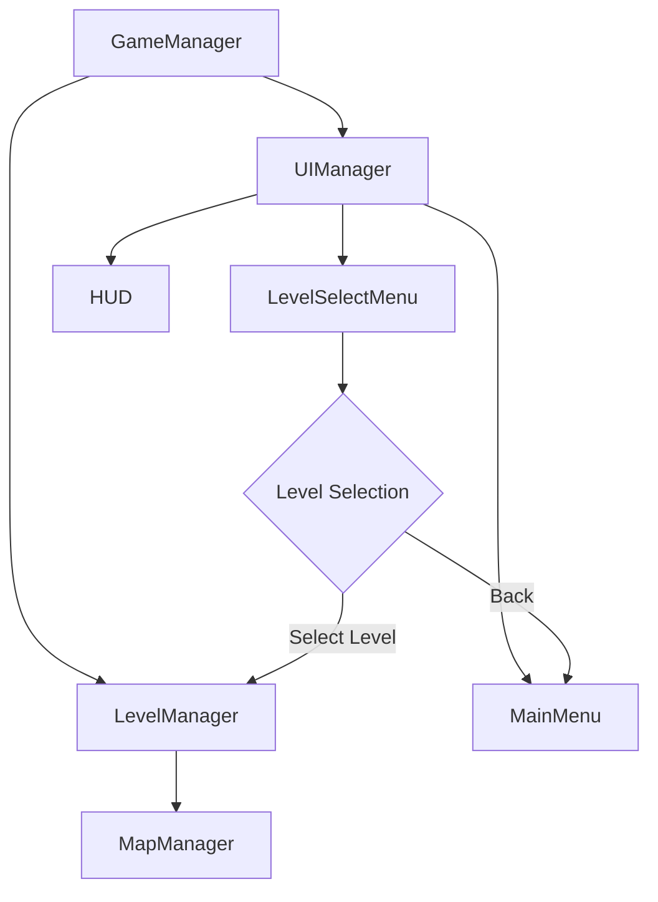
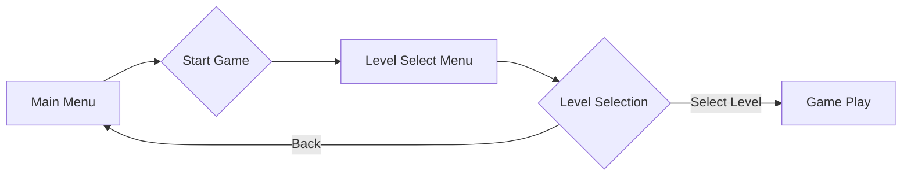

# Level System and UI Menu Design

## Overview

This document outlines the design for implementing a level system and UI menu system for the Zombie Tower Defense game. The system will allow players to select from multiple demo levels with different maps and difficulty settings, enhancing the testing and gameplay experience.

## Architecture

The level system will be integrated into the existing game architecture with the following components:

1. **LevelManager**: A new manager class responsible for level definitions, progression, and state management
2. **LevelSelectMenu**: A new UI component for level selection
3. **LevelData**: Interface defining the structure of level configurations
4. **Integration** with existing MapManager, GameManager, and UIManager



## Level System Design

### Level Data Structure

The level system will use a standardized data structure to define levels:

```typescript
interface LevelData {
  id: string;
  name: string;
  description: string;
  map: string; // Reference to map name in MapManager
  difficulty: 'Easy' | 'Normal' | 'Hard' | 'Nightmare';
  startingMoney: number;
  startingLives: number;
  resourceModifiers: {
    wood: number;
    metal: number;
    energy: number;
  };
  unlockConditions?: {
    previousLevel?: string;
    minimumScore?: number;
  };
}
```

### LevelManager Class

A new LevelManager class will be created to handle level definitions and progression:

```typescript
class LevelManager {
  private levels: Map<string, LevelData>;
  private currentLevel: string;
  private unlockedLevels: Set<string>;
  private mapManager: MapManager;
  
  constructor(mapManager: MapManager) {
    this.levels = new Map<string, LevelData>();
    this.currentLevel = '';
    this.unlockedLevels = new Set<string>();
    this.mapManager = mapManager;
    this.initializeLevels();
  }
  
  private initializeLevels(): void {
    // Initialize predefined levels
    this.levels.set('level1', {
      id: 'level1',
      name: 'Training Grounds',
      description: 'A basic level for learning the game mechanics',
      map: 'default',
      difficulty: 'Easy',
      startingMoney: 500,
      startingLives: 20,
      resourceModifiers: { wood: 1.0, metal: 1.0, energy: 1.0 }
    });
    
    this.levels.set('level2', {
      id: 'level2',
      name: 'Forest Path',
      description: 'Navigate through the dense forest with limited sight',
      map: 'forest',
      difficulty: 'Normal',
      startingMoney: 400,
      startingLives: 15,
      resourceModifiers: { wood: 1.5, metal: 0.8, energy: 1.0 },
      unlockConditions: { previousLevel: 'level1' }
    });
    
    this.levels.set('level3', {
      id: 'level3',
      name: 'Urban Maze',
      description: 'Defend against waves in the tight city streets',
      map: 'city',
      difficulty: 'Hard',
      startingMoney: 300,
      startingLives: 10,
      resourceModifiers: { wood: 0.8, metal: 1.5, energy: 1.2 },
      unlockConditions: { previousLevel: 'level2' }
    });
    
    // Unlock the first level by default
    this.unlockedLevels.add('level1');
  }
  
  public loadLevel(levelId: string): boolean {
    if (!this.levels.has(levelId) || !this.unlockedLevels.has(levelId)) {
      console.warn(`Level ${levelId} not found or not unlocked`);
      return false;
    }
    
    this.currentLevel = levelId;
    const level = this.levels.get(levelId)!;
    
    // Load the map for this level
    this.mapManager.loadMap(level.map);
    
    return true;
  }
  
  public getCurrentLevel(): LevelData | undefined {
    return this.levels.get(this.currentLevel);
  }
  
  public getAvailableLevels(): LevelData[] {
    return Array.from(this.levels.values())
      .filter(level => this.unlockedLevels.has(level.id));
  }
  
  public unlockLevel(levelId: string): void {
    if (this.levels.has(levelId)) {
      this.unlockedLevels.add(levelId);
    }
  }
}
```

## UI Menu System Design

### Level Select Menu Component

A new UI component will be created for level selection:

```typescript
class LevelSelectMenu extends UIComponent {
  private titleText: Text;
  private levelButtons: { button: Graphics, text: Text, levelId: string }[];
  private backButton: Graphics;
  private backButtonText: Text;
  private onLevelSelectCallback: ((levelId: string) => void) | null = null;
  private onBackCallback: (() => void) | null = null;
  
  constructor() {
    super();
    
    // Create title
    this.titleText = new Text({
      text: 'SELECT LEVEL',
      style: {
        fontFamily: 'Arial',
        fontSize: 36,
        fontWeight: 'bold',
        fill: 0xffffff,
        align: 'center',
      }
    });
    this.titleText.anchor.set(0.5);
    this.titleText.position.set(512, 100);
    this.addChild(this.titleText);
    
    // Create level buttons (will be populated dynamically)
    this.levelButtons = [];
    
    // Create back button
    this.backButton = new Graphics();
    this.backButton.roundRect(0, 0, 150, 50, 10).fill(0xff0000);
    this.backButton.position.set(50, 650);
    this.backButton.eventMode = 'static';
    this.backButton.cursor = 'pointer';
    this.backButton.on('pointerdown', () => this.onBackClicked());
    this.addChild(this.backButton);
    
    // Create back button text
    this.backButtonText = new Text({
      text: 'BACK',
      style: {
        fontFamily: 'Arial',
        fontSize: 24,
        fill: 0xffffff,
        align: 'center',
      }
    });
    this.backButtonText.anchor.set(0.5);
    this.backButtonText.position.set(125, 675);
    this.addChild(this.backButtonText);
  }
  
  public updateLevels(levels: LevelData[]): void {
    // Clear existing level buttons
    this.levelButtons.forEach(item => {
      item.button.destroy();
      item.text.destroy();
    });
    this.levelButtons = [];
    
    // Create buttons for each level
    levels.forEach((level, index) => {
      const x = 200 + (index % 3) * 220;
      const y = 200 + Math.floor(index / 3) * 120;
      
      // Create level button
      const button = new Graphics();
      button.roundRect(0, 0, 200, 80, 10).fill(0x00aa00);
      button.position.set(x, y);
      button.eventMode = 'static';
      button.cursor = 'pointer';
      button.on('pointerdown', () => this.onLevelSelected(level.id));
      this.addChild(button);
      
      // Create level text
      const levelText = new Text({
        text: `${level.name}\n${level.difficulty}`,
        style: {
          fontFamily: 'Arial',
          fontSize: 16,
          fill: 0xffffff,
          align: 'center',
        }
      });
      levelText.anchor.set(0.5);
      levelText.position.set(x + 100, y + 40);
      this.addChild(levelText);
      
      this.levelButtons.push({
        button,
        text: levelText,
        levelId: level.id
      });
    });
  }
  
  public update(deltaTime: number): void {
    // Level select menu animation or updates
  }
  
  private onLevelSelected(levelId: string): void {
    console.log(`Level selected: ${levelId}`);
    if (this.onLevelSelectCallback) {
      this.onLevelSelectCallback(levelId);
    }
  }
  
  private onBackClicked(): void {
    console.log('Back button clicked');
    if (this.onBackCallback) {
      this.onBackCallback();
    }
  }
  
  public setLevelSelectCallback(callback: (levelId: string) => void): void {
    this.onLevelSelectCallback = callback;
  }
  
  public setBackCallback(callback: () => void): void {
    this.onBackCallback = callback;
  }
}
```

### Updated Menu Flow

The menu system will be updated to include a level selection screen between the main menu and the game:



## Integration with Existing Systems

### GameManager Integration

The GameManager will be updated to include the LevelManager and handle level loading:

```typescript
class GameManager {
  // ... existing properties ...
  private levelManager: LevelManager;
  
  constructor(app: Application) {
    // ... existing initialization ...
    this.levelManager = new LevelManager(this.mapManager);
  }
  
  public startGame(levelId: string): void {
    if (this.levelManager.loadLevel(levelId)) {
      const level = this.levelManager.getCurrentLevel();
      if (level) {
        // Set level-specific game parameters
        this.money = level.startingMoney;
        this.lives = level.startingLives;
        // Apply resource modifiers
        // ... other level-specific initialization ...
        
        this.currentState = GameConfig.GAME_STATES.PLAYING;
        console.log(`Game started with level: ${level.name}`);
      }
    } else {
      console.error(`Failed to load level: ${levelId}`);
    }
  }
  
  public getLevelManager(): LevelManager {
    return this.levelManager;
  }
}
```

### UIManager Integration

The UIManager will be updated to manage the new LevelSelectMenu component:

```typescript
class UIManager {
  // ... existing properties ...
  
  // Update component visibility based on game state
  private updateComponentVisibility(): void {
    switch (this.currentState) {
      case GameConfig.GAME_STATES.MAIN_MENU:
        this.setComponentVisibility('mainMenu', true);
        this.setComponentVisibility('levelSelectMenu', false);
        this.setComponentVisibility('hud', false);
        break;
      case GameConfig.GAME_STATES.LEVEL_SELECT:
        this.setComponentVisibility('mainMenu', false);
        this.setComponentVisibility('levelSelectMenu', true);
        this.setComponentVisibility('hud', false);
        break;
      case GameConfig.GAME_STATES.PLAYING:
        this.setComponentVisibility('mainMenu', false);
        this.setComponentVisibility('levelSelectMenu', false);
        this.setComponentVisibility('hud', true);
        break;
      // ... other states ...
    }
  }
}
```

### Main Application Integration

The main.ts file will be updated to include the new menu flow:

```typescript
// In main.ts initialization
const levelSelectMenu = new LevelSelectMenu();
uiManager.registerComponent('levelSelectMenu', levelSelectMenu);

// Set up event handlers
mainMenu.setStartCallback(() => {
  // Show level select menu instead of starting game directly
  uiManager.setState('LevelSelect');
  // Update level select menu with available levels
  const levels = gameManager.getLevelManager().getAvailableLevels();
  levelSelectMenu.updateLevels(levels);
});

levelSelectMenu.setLevelSelectCallback((levelId: string) => {
  gameManager.startGame(levelId);
  uiManager.setState(gameManager.getCurrentState());
});

levelSelectMenu.setBackCallback(() => {
  uiManager.setState(GameConfig.GAME_STATES.MAIN_MENU);
});
```

## Data Models

### Level Data Model

| Field | Type | Description |
|-------|------|-------------|
| id | string | Unique identifier for the level |
| name | string | Display name of the level |
| description | string | Brief description of the level |
| map | string | Reference to the map to use |
| difficulty | enum | Difficulty level (Easy, Normal, Hard, Nightmare) |
| startingMoney | number | Initial money for the level |
| startingLives | number | Initial lives for the level |
| resourceModifiers | object | Modifiers for resource generation |
| unlockConditions | object (optional) | Conditions to unlock this level |

## Business Logic

### Level Progression Logic

1. Players start with the first level unlocked
2. Completing a level unlocks the next level in the sequence
3. Levels can also be unlocked based on achieving minimum scores
4. Players can replay any unlocked level

### Level Loading Process

1. Player selects a level from the LevelSelectMenu
2. LevelManager validates the level exists and is unlocked
3. MapManager loads the appropriate map for the level
4. GameManager initializes game state with level-specific parameters
5. UIManager transitions to the game play state

## Testing

### Unit Tests for LevelManager

```typescript
// Test level initialization
test('LevelManager initializes with default levels', () => {
  const mapManager = new MapManager();
  const levelManager = new LevelManager(mapManager);
  
  expect(levelManager.getAvailableLevels().length).toBeGreaterThan(0);
});

// Test level loading
test('LevelManager can load valid unlocked levels', () => {
  const mapManager = new MapManager();
  const levelManager = new LevelManager(mapManager);
  
  const result = levelManager.loadLevel('level1');
  expect(result).toBe(true);
  expect(levelManager.getCurrentLevel()?.id).toBe('level1');
});

// Test level unlocking
test('LevelManager can unlock levels', () => {
  const mapManager = new MapManager();
  const levelManager = new LevelManager(mapManager);
  
  // Initially level2 should not be available
  const initialAvailable = levelManager.getAvailableLevels().map(l => l.id);
  expect(initialAvailable).not.toContain('level2');
  
  // Unlock level2
  levelManager.unlockLevel('level2');
  
  // Now level2 should be available
  const updatedAvailable = levelManager.getAvailableLevels().map(l => l.id);
  expect(updatedAvailable).toContain('level2');
});
```

### UI Component Tests

```typescript
// Test LevelSelectMenu creation
test('LevelSelectMenu creates with required elements', () => {
  const menu = new LevelSelectMenu();
  
  // Should have title text
  expect(menu.children.length).toBeGreaterThan(0);
  
  // Should have back button
  // Implementation details would depend on how children are tracked
});

// Test level button generation
test('LevelSelectMenu updates with level buttons', () => {
  const menu = new LevelSelectMenu();
  const mockLevels: LevelData[] = [
    {
      id: 'test1',
      name: 'Test Level 1',
      description: 'A test level',
      map: 'default',
      difficulty: 'Easy',
      startingMoney: 500,
      startingLives: 20,
      resourceModifiers: { wood: 1, metal: 1, energy: 1 }
    }
  ];
  
  menu.updateLevels(mockLevels);
  // Verify buttons are created (implementation dependent)
});
```