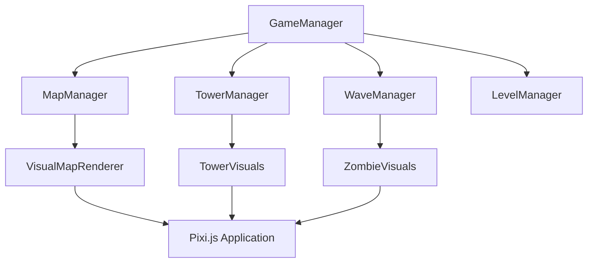

# Map Rendering Setup Design Document

## 1. Overview

This document outlines the design for implementing map rendering functionality in the Zombie Tower Defense game. Currently, when a level is selected, no map, turrets, or zombies are being rendered. This is because the visual representation of the game world has not been implemented yet. This design will establish the foundation for rendering the game map, including visual elements such as terrain, paths, and interactive elements.

## 2. Architecture

The map rendering system will be integrated into the existing architecture with the following components:



### 2.1 Key Components

| Component | Responsibility |
|-----------|----------------|
| `MapManager` | Manages map data, waypoints, and pathfinding |
| `VisualMapRenderer` | Handles the visual rendering of the map |
| `GameManager` | Coordinates game systems and rendering updates |
| `Pixi.js Application` | Provides the rendering context for visual elements |

## 3. Implementation Plan

### 3.1 VisualMapRenderer Class

A new `VisualMapRenderer` class will be created to handle all visual aspects of the map:

```typescript
// src/renderers/VisualMapRenderer.ts
import { Application, Graphics, Sprite, Texture } from 'pixi.js';
import { MapManager, MapData } from '../managers/MapManager';

export class VisualMapRenderer {
  private app: Application;
  private mapManager: MapManager;
  private mapContainer: Graphics;
  private pathGraphics: Graphics;
  
  constructor(app: Application, mapManager: MapManager) {
    this.app = app;
    this.mapManager = mapManager;
    this.mapContainer = new Graphics();
    this.pathGraphics = new Graphics();
    this.app.stage.addChild(this.mapContainer);
    this.app.stage.addChild(this.pathGraphics);
  }
  
  public renderMap(mapName: string): void {
    // Clear previous map
    this.mapContainer.clear();
    this.pathGraphics.clear();
    
    // Get map data
    const mapData = this.mapManager.getCurrentMap();
    if (!mapData) return;
    
    // Render map background
    this.renderMapBackground(mapData);
    
    // Render path
    this.renderPath(mapData);
  }
  
  private renderMapBackground(mapData: MapData): void {
    // Draw grass background
    this.mapContainer.fill({ color: 0x33aa33 });
    this.mapContainer.rect(0, 0, mapData.width, mapData.height);
    
    // Add some visual elements like trees or rocks
    this.addDecorativeElements(mapData);
  }
  
  private renderPath(mapData: MapData): void {
    if (mapData.waypoints.length < 2) return;
    
    // Draw path
    this.pathGraphics.fill({ color: 0x888888 });
    this.pathGraphics.stroke({ width: 40, color: 0x555555 });
    
    // Move to first point
    this.pathGraphics.moveTo(mapData.waypoints[0].x, mapData.waypoints[0].y);
    
    // Draw lines between waypoints
    for (let i = 1; i < mapData.waypoints.length; i++) {
      this.pathGraphics.lineTo(mapData.waypoints[i].x, mapData.waypoints[i].y);
    }
  }
  
  private addDecorativeElements(mapData: MapData): void {
    // Add some random decorative elements to make the map more visually interesting
    // This is a simplified implementation - in a full game this would be more sophisticated
    for (let i = 0; i < 20; i++) {
      const x = Math.random() * mapData.width;
      const y = Math.random() * mapData.height;
      
      // Only place decorations away from the path
      if (this.isAwayFromPath(x, y, mapData.waypoints)) {
        this.mapContainer.fill({ color: 0x228822 });
        this.mapContainer.circle(x, y, 5 + Math.random() * 10);
      }
    }
  }
  
  private isAwayFromPath(x: number, y: number, waypoints: Waypoint[]): boolean {
    // Simple distance check from path
    for (let i = 0; i < waypoints.length - 1; i++) {
      const p1 = waypoints[i];
      const p2 = waypoints[i + 1];
      
      // Calculate distance from point to line segment
      const distance = this.distanceToLineSegment(x, y, p1.x, p1.y, p2.x, p2.y);
      if (distance < 50) return false; // Too close to path
    }
    return true;
  }
  
  private distanceToLineSegment(x: number, y: number, x1: number, y1: number, x2: number, y2: number): number {
    // Simplified distance calculation
    const A = x - x1;
    const B = y - y1;
    const C = x2 - x1;
    const D = y2 - y1;
    
    const dot = A * C + B * D;
    const lenSq = C * C + D * D;
    let param = -1;
    
    if (lenSq !== 0) param = dot / lenSq;
    
    let xx, yy;
    
    if (param < 0) {
      xx = x1;
      yy = y1;
    } else if (param > 1) {
      xx = x2;
      yy = y2;
    } else {
      xx = x1 + param * C;
      yy = y1 + param * D;
    }
    
    const dx = x - xx;
    const dy = y - yy;
    return Math.sqrt(dx * dx + dy * dy);
  }
  
  public clear(): void {
    this.mapContainer.clear();
    this.pathGraphics.clear();
  }
}
```

### 3.2 Integration with GameManager

The `GameManager` will be updated to include and manage the `VisualMapRenderer`:

```typescript
// src/managers/GameManager.ts (additional properties and methods)
import { VisualMapRenderer } from '../renderers/VisualMapRenderer';

export class GameManager {
  // ... existing properties ...
  private visualMapRenderer: VisualMapRenderer;
  
  constructor(app: Application) {
    // ... existing constructor code ...
    this.visualMapRenderer = new VisualMapRenderer(app, this.mapManager);
  }
  
  public startGameWithLevel(levelId: string): void {
    if (this.levelManager.loadLevel(levelId)) {
      const level = this.levelManager.getCurrentLevel();
      if (level) {
        // Set level-specific game parameters
        this.money = level.startingMoney;
        this.lives = level.startingLives;
        // Apply resource modifiers
        // ... other level-specific initialization ...
        
        // Render the map for this level
        this.visualMapRenderer.renderMap(level.map);
        
        this.currentState = GameConfig.GAME_STATES.PLAYING;
        console.log(`Game started with level: ${level.name}`);
      }
    } else {
      console.error(`Failed to load level: ${levelId}`);
    }
  }
  
  // ... existing methods ...
}
```

### 3.3 Updates to Main Application Loop

The main application loop in `main.ts` needs to be updated to handle rendering:

```typescript
// src/main.ts (updated ticker section)
// Listen for animate update
let lastTime = performance.now();
app.ticker.add((time) => {
  const currentTime = performance.now();
  const deltaTime = (currentTime - lastTime) / 1000; // Convert to seconds
  lastTime = currentTime;
  
  // Update game systems based on current state
  if (gameManager.getCurrentState() === 'Playing') {
    // Update game objects, towers, zombies, etc.
    // This would be implemented in a full game
    
    // For now, we just ensure the map is rendered when the game starts
    // In a complete implementation, this would update positions, animations, etc.
  }
  
  // Update UI
  uiManager.update(deltaTime);
  
  // Update HUD with current game state
  hud.updateMoney(gameManager.getMoney());
  hud.updateLives(gameManager.getLives());
  hud.updateWave(gameManager.getWave());
});
```

## 4. Data Models

### 4.1 Extended MapData Interface

The `MapData` interface will be extended to include visual properties:

```typescript
// src/managers/MapManager.ts (extended interface)
export interface MapData {
  name: string;
  width: number;
  height: number;
  waypoints: Waypoint[];
  // Visual properties
  backgroundColor?: number;
  pathColor?: number;
  pathWidth?: number;
  decorations?: {
    type: 'tree' | 'rock' | 'bush';
    x: number;
    y: number;
    size: number;
  }[];
}
```

## 5. Rendering Pipeline

The rendering pipeline will follow these steps:

1. **Map Initialization**: When a level is selected, the `MapManager` loads the appropriate map data
2. **Visual Renderer Creation**: The `VisualMapRenderer` creates visual representations of the map
3. **Background Rendering**: The map background is rendered with appropriate colors/textures
4. **Path Rendering**: The zombie path is rendered as a distinct visual element
5. **Decorative Elements**: Trees, rocks, and other decorative elements are added to the map
6. **Interactive Elements**: Towers and other interactive elements are added (in future implementations)

## 6. Testing Strategy

### 6.1 Unit Tests

Unit tests will be implemented for the `VisualMapRenderer` class:

```typescript
// src/renderers/VisualMapRenderer.test.ts
import { VisualMapRenderer } from './VisualMapRenderer';
import { Application } from 'pixi.js';
import { MapManager } from '../managers/MapManager';

describe('VisualMapRenderer', () => {
  let app: Application;
  let mapManager: MapManager;
  let renderer: VisualMapRenderer;
  
  beforeEach(() => {
    app = new Application();
    mapManager = new MapManager();
    renderer = new VisualMapRenderer(app, mapManager);
  });
  
  it('should create map container and path graphics', () => {
    expect(renderer).toBeTruthy();
    // Add more specific assertions about the created graphics objects
  });
  
  it('should render map background', () => {
    // Test background rendering with mock map data
  });
  
  it('should render path correctly', () => {
    // Test path rendering with waypoints
  });
});
```

### 6.2 Integration Tests

Integration tests will verify that the map rendering works correctly with the game manager:

```typescript
// src/managers/GameManager.test.ts (additional tests)
describe('GameManager Map Rendering', () => {
  it('should render map when starting game with level', () => {
    // Test that the visual map renderer is called when starting a game
  });
  
  it('should clear previous map when loading new level', () => {
    // Test that maps are properly cleared between level loads
  });
});
```

## 7. Performance Considerations

1. **Efficient Rendering**: Use Pixi.js containers and graphics batching for optimal performance
2. **Memory Management**: Properly destroy graphics objects when clearing maps
3. **Caching**: Cache decorative elements that don't change between frames
4. **Level of Detail**: Implement different detail levels for decorative elements based on zoom level

## 8. Future Extensions

1. **Texture Support**: Replace solid colors with textures for more realistic visuals
2. **Animation**: Add animated elements like waving grass or flowing water
3. **Dynamic Lighting**: Implement lighting effects that change based on time of day
4. **Particle Effects**: Add particle systems for environmental effects
5. **Parallax Scrolling**: Implement multi-layer backgrounds for depth perception