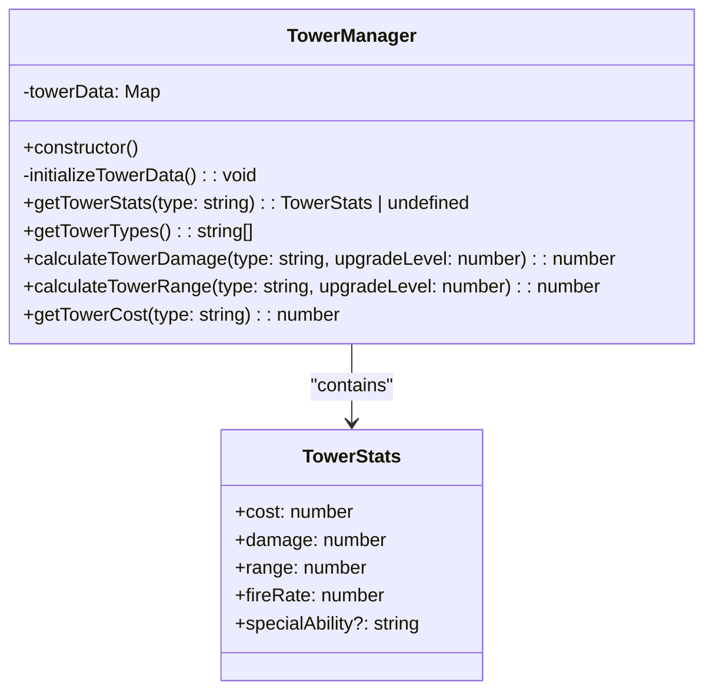

# Tower Manager Design Document

## 1. Overview

The Tower Manager is a core component of the Zombie Tower Defense game responsible for managing tower configurations, statistics, and upgrade calculations. It acts as a centralized repository for all tower-related data, providing a single source of truth for tower attributes across the game system.

The Tower Manager follows a data-driven approach where all tower statistics are defined in one place and accessed by various game components. This design promotes consistency, maintainability, and ease of balancing.

## 2. Architecture

The Tower Manager implements a manager pattern where a single instance is created and managed by the GameManager. The architecture follows these key principles:

- **Centralized Configuration**: All tower statistics are stored in one location
- **Decoupled Design**: Tower data is separate from tower behavior implementation
- **Extensible Structure**: Easy to add new tower types without modifying core logic
- **Performance Optimized**: Uses efficient data structures for quick lookups

### 2.1 Class Diagram



### 2.2 System Integration

```mermaid
graph TB
subgraph "Configuration"
  GameConfig[GameConfig.TOWER_TYPES]
end
subgraph "Managers"
  TowerManager[TowerManager]
  GameManager[GameManager]
end
subgraph "Objects"
  Tower[Tower]
  TowerFactory[TowerFactory]
end
GameConfig --> TowerManager
TowerManager --> Tower
GameManager --> TowerManager
TowerFactory --> Tower
Tower --> TowerManager : "upgrade calculations"
```

## 3. Data Models & Configuration

### 3.1 TowerStats Interface

The TowerStats interface defines the structure for storing tower configuration data:

| Property | Type | Description |
|---------|------|-------------|
| cost | number | Monetary cost to purchase the tower |
| damage | number | Base damage per shot |
| range | number | Attack range in pixels |
| fireRate | number | Shots per second |
| specialAbility | string (optional) | Description of special abilities |

### 3.2 Tower Types Configuration

The system currently supports 5 distinct tower types, each with unique characteristics:

| Tower Type | Cost | Damage | Range | Fire Rate | Special Ability |
|------------|------|--------|-------|-----------|-----------------|
| Machine Gun | 100 | 20 | 150 | 10 | High fire rate, good against swarms |
| Sniper | 250 | 150 | 400 | 1 | High single-target damage, armor-piercing |
| Shotgun | 180 | 40 | 100 | 3 | Multiple target hits, good crowd control |
| Flame | 200 | 30 | 120 | 5 | Area damage over time, burning effect |
| Tesla | 300 | 80 | 200 | 2 | Chain lightning, affects multiple targets |

## 4. Core Functionality

### 4.1 Tower Data Initialization

The TowerManager initializes all tower data during construction by mapping tower types (from GameConfig) to their respective statistics. This ensures all tower information is available immediately after instantiation.

### 4.2 Tower Statistics Retrieval

The `getTowerStats()` method provides access to base tower statistics for a given tower type. This is used during tower creation to initialize tower properties.

### 4.3 Upgrade Calculations

The TowerManager implements linear upgrade scaling:
- **Damage**: Base damage increased by 50% per upgrade level
- **Range**: Base range increased by 20% per upgrade level

This approach ensures predictable upgrade benefits while maintaining game balance.

### 4.4 Tower Type Enumeration

The `getTowerTypes()` method returns a list of all available tower types, enabling dynamic UI generation and validation.

## 5. Business Logic Layer

### 5.1 Upgrade System

The upgrade system is designed to provide consistent progression across all tower types:

1. When a tower is upgraded, it requests updated stats from TowerManager
2. TowerManager calculates new values based on upgrade level
3. Tower applies new stats to its properties

This centralized approach ensures all towers upgrade consistently and makes balancing easier.

### 5.2 Cost Calculation

Tower costs are fixed values stored in the TowerStats. Future enhancements could include:
- Dynamic cost scaling based on game progression
- Discount systems for specific tower types
- Resource cost combinations (money + materials)

## 6. Performance Considerations

### 6.1 Data Structure Efficiency

The TowerManager uses a Map data structure for O(1) average-case lookup performance when retrieving tower statistics. Given the small number of tower types (5), this provides excellent performance with minimal memory overhead.

### 6.2 Object Creation Optimization

Currently, Tower instances create new TowerManager instances when upgrading. This could be optimized by:
- Implementing a true singleton pattern for TowerManager
- Using dependency injection to share a single instance
- Caching calculated upgrade values to avoid repeated calculations

## 7. Extension Points

### 7.1 Adding New Tower Types

To add a new tower type:
1. Add new constant to `GameConfig.TOWER_TYPES`
2. Register tower stats in `TowerManager.initializeTowerData()`
3. Create new class extending `Tower` in `src/objects/towers/`
4. Add case to `TowerFactory.createTower()`

### 7.2 Advanced Upgrade Mechanics

Future enhancements could include:
- Non-linear upgrade scaling (exponential, logarithmic)
- Specialized upgrade paths (damage vs. range focus)
- Tower-specific upgrade bonuses
- Synergy effects between tower types

## 8. Testing

### 8.1 Unit Tests

The TowerManager should include tests for:
- Tower data initialization correctness
- Stat retrieval accuracy
- Upgrade calculation precision
- Tower type enumeration completeness

### 8.2 Integration Tests

Integration tests should verify:
- Proper interaction with Tower instances
- Correct upgrade application
- Consistent data access across game components