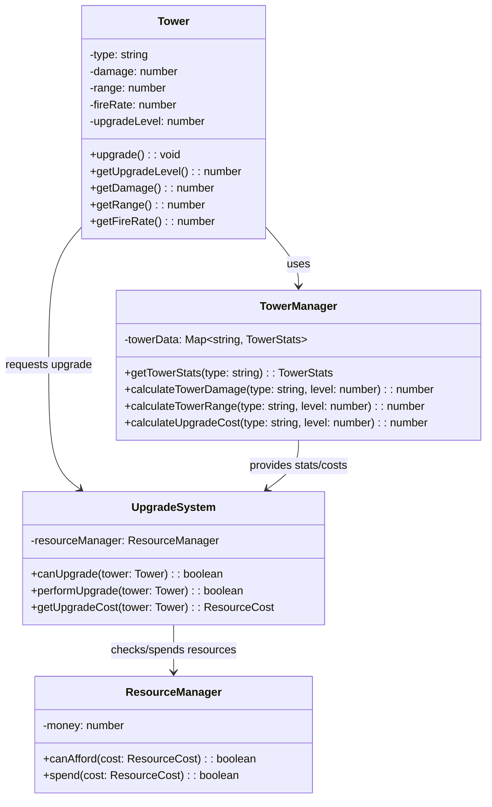
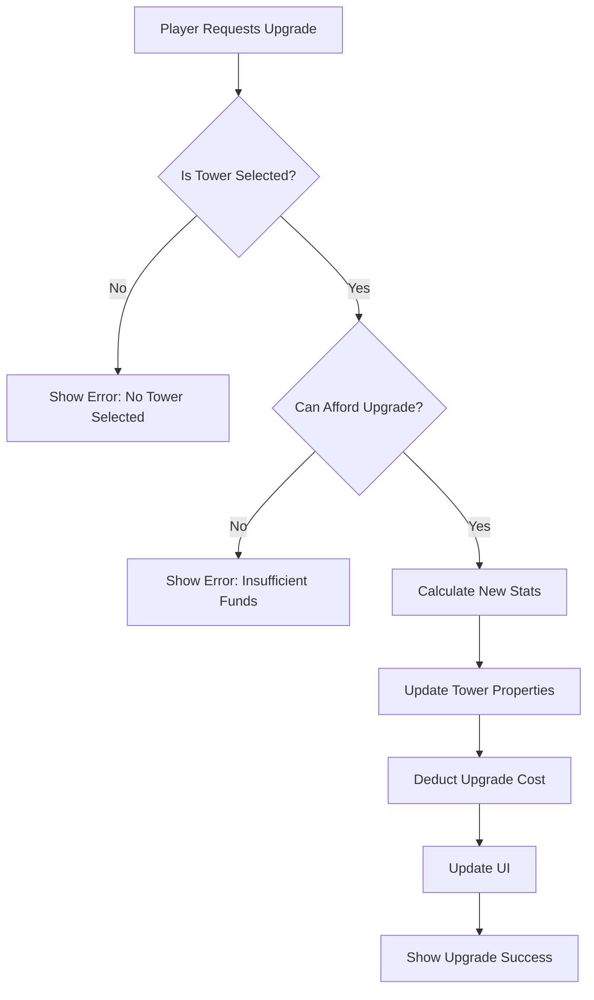

# Upgrade Mechanic Foundation Design

## 1. Overview

This document outlines the foundation for implementing a tower upgrade system in the Zombie Tower Defense game. The upgrade system will allow players to enhance their towers' capabilities by spending in-game resources, providing strategic depth and progression.

## 2. Architecture

### 2.1 Core Components

The upgrade system will be built upon the existing tower architecture with the following key components:



### 2.2 Upgrade Progression Model

The upgrade system will follow a multi-dimensional progression model:

1. **Linear Stat Scaling**: Each upgrade level increases tower stats by a fixed percentage
2. **Exponential Cost Scaling**: Upgrade costs increase exponentially to prevent snowballing
3. **Specialization Paths**: Future enhancements could include branching upgrade paths

## 3. Data Models

### 3.1 TowerStats Extension

The existing `TowerStats` interface will be extended to include upgrade information:

| Property | Type | Description |
|----------|------|-------------|
| cost | number | Base cost to purchase the tower |
| damage | number | Base damage per shot |
| range | number | Base targeting range |
| fireRate | number | Shots per second |
| specialAbility | string (optional) | Special properties |
| upgradeCostMultiplier | number | Cost scaling factor for upgrades |

### 3.2 Upgrade Cost Calculation

The upgrade cost will be calculated using the formula:
```
upgradeCost = baseCost × (upgradeLevel + 1) × upgradeCostMultiplier
```

Where:
- `baseCost` is the tower's initial purchase cost
- `upgradeLevel` is the current level (1-based)
- `upgradeCostMultiplier` is a tower-specific value (default: 0.75)

## 4. Business Logic

### 4.1 Upgrade Process Flow



### 4.2 Tower Upgrade Implementation

The `Tower` class will be enhanced with the following methods:

1. **upgrade()**: Performs the upgrade operation
2. **getUpgradeCost()**: Calculates the cost for the next upgrade
3. **getMaxUpgradeLevel()**: Returns the maximum allowed upgrade level

### 4.3 Stat Scaling Formulas

Tower stats will scale using these formulas:

- **Damage**: `floor(baseDamage × (1 + upgradeLevel × 0.5))`
- **Range**: `floor(baseRange × (1 + upgradeLevel × 0.2))`
- **Fire Rate**: `baseFireRate × (1 + upgradeLevel × 0.1)` (optional)

## 5. Integration Points

### 5.1 UI Integration

The upgrade system will integrate with the UI through:

1. **Tower Selection Panel**: Shows upgrade button and cost
2. **Resource Display**: Updates when costs are deducted
3. **Tower Stats Panel**: Displays current and next-level stats

### 5.2 Game Manager Integration

The `GameManager` will coordinate:

1. **Resource Validation**: Checking if players can afford upgrades
2. **State Management**: Ensuring upgrades only happen during appropriate game states
3. **Event Handling**: Broadcasting upgrade events to interested systems

## 6. Testing

### 6.1 Unit Tests

Unit tests will cover:

1. **Stat Calculations**: Verify that upgraded stats are calculated correctly
2. **Cost Calculations**: Ensure upgrade costs scale appropriately
3. **Resource Management**: Test that resources are properly deducted
4. **Edge Cases**: Handle maximum levels, insufficient funds, etc.

### 6.2 Integration Tests

Integration tests will verify:

1. **Full Upgrade Flow**: From player request to UI update
2. **Resource Consistency**: Ensure money is properly tracked
3. **Tower Behavior**: Confirm upgraded towers perform as expected
