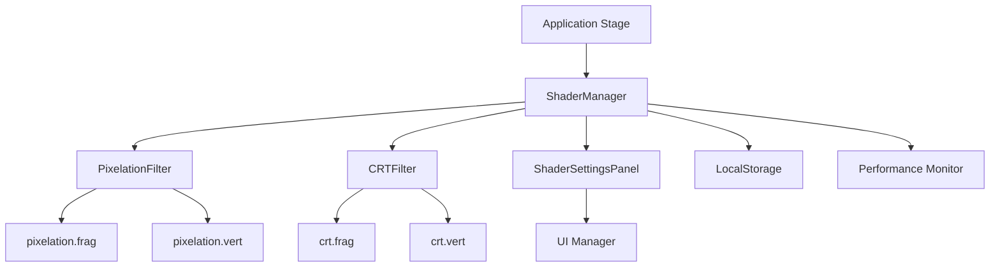
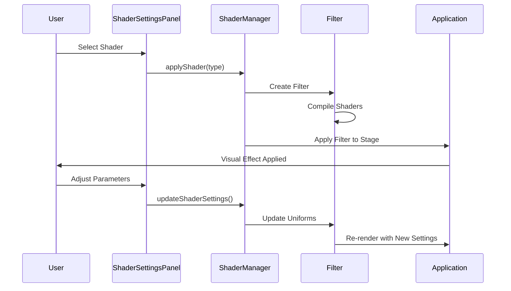

# Design Document

## Overview

The retro shaders feature will add nostalgic visual effects to Z-TD through custom PixiJS shaders. The system will implement two primary effects: pixelation for an 8-bit aesthetic and CRT (Cathode Ray Tube) effects for a vintage monitor experience. The shaders will be implemented as post-processing filters that can be toggled and customized through a dedicated settings panel.

## Architecture

### Shader System Architecture

The shader system will be built using PixiJS's Filter system, which allows for post-processing effects to be applied to the entire game stage or specific containers. The architecture follows a modular approach:

```
src/ui/shaders/
├── ShaderManager.ts          # Central shader management
├── filters/                  # Custom filter implementations
│   ├── PixelationFilter.ts   # Pixelation effect
│   ├── CRTFilter.ts          # CRT effect
│   └── BaseRetroFilter.ts    # Base class for retro filters
├── shaders/                  # GLSL shader files
│   ├── pixelation.frag       # Pixelation fragment shader
│   ├── pixelation.vert       # Pixelation vertex shader
│   ├── crt.frag              # CRT fragment shader
│   └── crt.vert              # CRT vertex shader
└── ShaderSettingsPanel.ts    # UI for shader configuration
```

### Integration with Existing System

The shader system will integrate with the existing PixiJS application and UI management system:

1. **Application Level**: Shaders will be applied to the main application stage
2. **UI Manager Integration**: Shader settings panel will be registered as a UI component
3. **Settings Persistence**: Shader preferences will be saved to localStorage
4. **Performance Monitoring**: Shader impact will be tracked through existing debug systems

## Components and Interfaces

### ShaderManager

Central management class for all shader operations:

```typescript
interface IShaderManager {
  // Shader lifecycle
  initialize(app: Application): void;
  applyShader(shaderType: ShaderType): void;
  removeShader(): void;

  // Configuration
  updateShaderSettings(settings: ShaderSettings): void;
  getAvailableShaders(): ShaderType[];

  // State management
  getCurrentShader(): ShaderType | null;
  isShaderActive(): boolean;
}

enum ShaderType {
  NONE = 'none',
  PIXELATION = 'pixelation',
  CRT = 'crt',
}

interface ShaderSettings {
  pixelation: {
    pixelSize: number; // 1-8
    enabled: boolean;
  };
  crt: {
    curvature: number; // 0.0-1.0
    scanlineIntensity: number; // 0.0-1.0
    phosphorGlow: number; // 0.0-1.0
    screenFlicker: number; // 0.0-1.0
    noiseAmount: number; // 0.0-1.0
    enabled: boolean;
  };
}
```

### BaseRetroFilter

Abstract base class for all retro filters:

```typescript
abstract class BaseRetroFilter extends Filter {
  protected settings: Record<string, number>;

  constructor(vertexShader: string, fragmentShader: string);
  abstract updateSettings(settings: Record<string, number>): void;
  abstract getDefaultSettings(): Record<string, number>;
}
```

### PixelationFilter

Implements pixelation effect using nearest-neighbor sampling:

```typescript
class PixelationFilter extends BaseRetroFilter {
  constructor();
  updateSettings(settings: { pixelSize: number }): void;
  setPixelSize(size: number): void;
}
```

### CRTFilter

Implements comprehensive CRT monitor simulation:

```typescript
class CRTFilter extends BaseRetroFilter {
  constructor();
  updateSettings(settings: CRTSettings): void;
  setCurvature(amount: number): void;
  setScanlineIntensity(intensity: number): void;
  setPhosphorGlow(glow: number): void;
  setScreenFlicker(flicker: number): void;
  setNoiseAmount(noise: number): void;
}
```

### ShaderSettingsPanel

UI component for shader configuration:

```typescript
class ShaderSettingsPanel extends UIComponent {
  constructor();
  setShaderManager(manager: ShaderManager): void;
  updateShaderList(shaders: ShaderType[]): void;
  showShaderSettings(shaderType: ShaderType): void;
  hideShaderSettings(): void;
}
```

## Data Models

### Shader Configuration Storage

```typescript
interface StoredShaderConfig {
  version: string;
  activeShader: ShaderType;
  settings: ShaderSettings;
  lastModified: string;
}
```

### Performance Metrics

```typescript
interface ShaderPerformanceMetrics {
  frameRate: number;
  renderTime: number;
  memoryUsage: number;
  shaderCompileTime: number;
}
```

## Error Handling

### Shader Compilation Errors

1. **Graceful Fallback**: If shader compilation fails, fall back to no shader
2. **Error Logging**: Log detailed shader compilation errors for debugging
3. **User Notification**: Display user-friendly error messages in settings panel
4. **Retry Mechanism**: Allow users to retry shader application after fixing issues

### WebGL Compatibility

1. **Feature Detection**: Check for WebGL support before enabling shaders
2. **Fallback Mode**: Provide alternative visual indicators when shaders aren't supported
3. **Performance Monitoring**: Automatically disable shaders if performance drops below threshold

### Memory Management

1. **Filter Cleanup**: Properly dispose of filters when switching or disabling
2. **Texture Management**: Monitor texture memory usage for shader effects
3. **Garbage Collection**: Ensure proper cleanup of shader resources

## Testing Strategy

### Unit Tests

1. **ShaderManager Tests**: Test shader lifecycle and state management
2. **Filter Tests**: Test individual filter parameter updates and effects
3. **Settings Persistence**: Test saving and loading of shader preferences
4. **Error Handling**: Test graceful handling of shader compilation failures

### Integration Tests

1. **UI Integration**: Test shader settings panel integration with UI manager
2. **Performance Impact**: Test frame rate impact of different shader combinations
3. **State Transitions**: Test shader switching during different game states
4. **Memory Leaks**: Test for memory leaks during extended shader usage

### Visual Tests

1. **Effect Verification**: Visual comparison tests for shader effects
2. **Parameter Ranges**: Test shader parameters at minimum, maximum, and mid-range values
3. **Cross-browser Testing**: Test shader compatibility across different browsers
4. **Device Testing**: Test performance on different hardware configurations

## Implementation Details

### GLSL Shader Implementation

#### Pixelation Fragment Shader

```glsl
precision mediump float;
varying vec2 vTextureCoord;
uniform sampler2D uSampler;
uniform float pixelSize;
uniform vec2 resolution;

void main(void) {
    vec2 coord = vTextureCoord * resolution;
    coord = floor(coord / pixelSize) * pixelSize;
    coord /= resolution;
    gl_FragColor = texture2D(uSampler, coord);
}
```

#### CRT Fragment Shader Features

- Screen curvature using barrel distortion
- Scanlines with configurable intensity
- Phosphor glow using bloom effect
- Screen flicker with time-based variation
- RGB noise simulation

### Performance Optimizations

1. **Shader Caching**: Cache compiled shaders to avoid recompilation
2. **Conditional Rendering**: Only apply shaders when effects are visible
3. **LOD System**: Reduce shader complexity based on performance metrics
4. **Batch Processing**: Minimize shader state changes per frame

### Settings Panel Design

The shader settings panel will feature:

1. **Shader Selection**: Dropdown or tabs for choosing shader type
2. **Real-time Preview**: Live preview of shader effects while adjusting parameters
3. **Preset System**: Pre-configured shader presets for common looks
4. **Performance Indicator**: Visual indicator of current performance impact
5. **Reset Options**: Quick reset to default settings

### Integration Points

1. **Main Application**: Apply shaders to `app.stage` for full-screen effects
2. **UI Manager**: Register settings panel as a UI component
3. **Settings System**: Integrate with existing game configuration system
4. **Debug System**: Add shader performance metrics to debug panel
5. **Input Handling**: Handle keyboard shortcuts for quick shader toggling

## Mermaid Diagrams

### Shader System Architecture



### Shader Lifecycle



This design provides a robust, extensible shader system that integrates seamlessly with Z-TD's existing architecture while maintaining performance and user experience standards.
