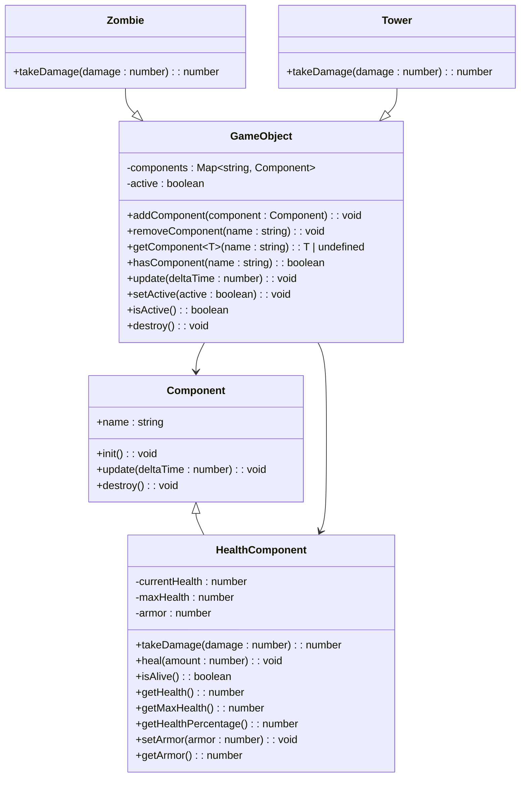
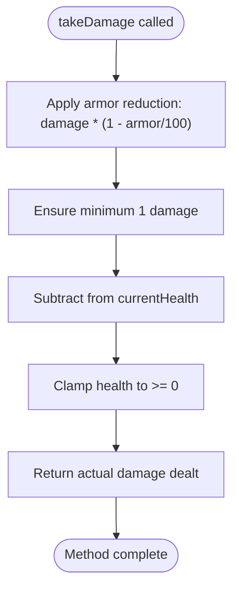

# Health Component System Documentation

## Overview

The Health Component System is a core part of the Zombie Tower Defence game's Entity-Component architecture. It provides a standardized way to manage health, damage calculation, healing, and death events for all game entities that require health management, such as zombies and towers.

This system implements the Entity-Component pattern, where the `HealthComponent` class extends the base `Component` class and can be attached to any `GameObject` to provide health-related functionality.

## Architecture

### Component System Structure

The Health Component System follows the Entity-Component-System (ECS) architectural pattern:



### Core Properties

The HealthComponent maintains three primary internal state variables:

- **currentHealth**: Tracks the entity's current health value, initialized to `maxHealth` and reduced when taking damage.
- **maxHealth**: Defines the upper limit of health, determined at instantiation based on entity type and game progression.
- **armor**: Represents damage reduction as a percentage (0–100), where 100 blocks all damage and 0 applies no mitigation.

These properties are private to enforce encapsulation, with public accessor methods providing controlled read and write operations.

## Component Implementation

### Constructor

The HealthComponent constructor initializes the health values:

```typescript
constructor(maxHealth: number, armor: number = 0) {
  super('Health');
  this.maxHealth = maxHealth;
  this.currentHealth = maxHealth;
  this.armor = armor;
}
```

### Damage Calculation and Armor Mitigation

When an entity takes damage, the `takeDamage()` method computes the effective damage after applying armor reduction. The formula used is:

```
reducedDamage = damage * (1 - armor / 100)
```

This scales linearly—e.g., 30 armor reduces incoming damage by 30%. The result is floored and clamped to a minimum of 1 to prevent negligible damage from being ignored entirely.

```typescript
public takeDamage(damage: number): number {
  const reducedDamage = damage * (1 - this.armor / 100);
  const actualDamage = Math.max(1, Math.floor(reducedDamage));
  
  this.currentHealth -= actualDamage;
  this.currentHealth = Math.max(0, this.currentHealth);
  
  return actualDamage;
}
```

This ensures that even highly armored entities can be damaged, maintaining gameplay balance. The method returns the actual damage dealt, which can be used for visual effects or UI feedback.

### Healing and Health Management

The `heal()` method safely increases the current health without exceeding `maxHealth`, using `Math.min()` to cap the value:

```typescript
public heal(amount: number): void {
  this.currentHealth = Math.min(this.maxHealth, this.currentHealth + amount);
}
```

Additional utility methods provide health status information:

- `isAlive()`: Returns `true` if `currentHealth > 0`
- `getHealth()`: Returns current health value
- `getMaxHealth()`: Returns maximum health
- `getHealthPercentage()`: Returns health as a percentage of max

```typescript
public isAlive(): boolean {
  return this.currentHealth > 0;
}

public getHealthPercentage(): number {
  return (this.currentHealth / this.maxHealth) * 100;
}
```

These methods support UI elements like health bars and death checks in game logic.

### Armor Management

Armor values are clamped between 0 and 100 to prevent invalid states:

```typescript
public setArmor(armor: number): void {
  this.armor = Math.max(0, Math.min(100, armor));
}

public getArmor(): number {
  return this.armor;
}
```

## Entity Integration Examples

### Zombie Entity Integration

In the `Zombie` class, the `HealthComponent` is instantiated during setup using wave-scaled health values from `WaveManager`.

```typescript
private initializeStats(wave: number): void {
  const waveManager = new WaveManager();
  const health = waveManager.calculateZombieHealth(this.type, wave);
  
  // Add health component
  const healthComponent = new HealthComponent(health);
  this.addComponent(healthComponent);
  
  // Set speed and reward based on type
  // ... rest of initialization
}
```

### Tower Entity Integration

Similarly, towers use the HealthComponent for durability:

```typescript
// In Tower class initializeStats method
let towerHealth = 100;
switch (this.type) {
  case GameConfig.TOWER_TYPES.MACHINE_GUN:
    towerHealth = 120;
    break;
  case GameConfig.TOWER_TYPES.SNIPER:
    towerHealth = 80;
    break;
  case GameConfig.TOWER_TYPES.SHOTGUN:
    towerHealth = 100;
    break;
  case GameConfig.TOWER_TYPES.FLAME:
    towerHealth = 90;
    break;
  case GameConfig.TOWER_TYPES.TESLA:
    towerHealth = 110;
    break;
}

const healthComponent = new HealthComponent(towerHealth);
this.addComponent(healthComponent);
```

## Damage Flow Process

The damage flow process is illustrated in the following diagram:



## WaveManager Integration and Resource Rewards

When a zombie is eliminated:
1. The game checks if `isAlive()` returns `false`
2. The zombie's `reward` value is added to player resources
3. The entity is destroyed and removed from the scene

```typescript
// In game loop or zombie update handler
if (!zombie.getComponent<HealthComponent>('Health').isAlive()) {
  player.addResources(zombie.getReward());
  zombie.destroy();
}
```

This integration ensures consistent reward scaling and progression.

## Common Issues and Edge Cases

### Floating-Point Health Values

Although health is stored as a number, all operations use `Math.floor()` on damage and `Math.max()`/`Math.min()` for bounds, preventing fractional health states.

### Armor Overflow

The `setArmor()` method clamps values between 0 and 100:

```typescript
public setArmor(armor: number): void {
  this.armor = Math.max(0, Math.min(100, armor));
}
```

This prevents invalid states like negative armor or over-100% damage reduction.

### Event Cleanup on Destroy

When a zombie dies, its components are automatically cleaned up via the entity system's `destroyEntity()` method. No manual event unbinding is required, reducing memory leak risks.

## Extension Points and Future Components

The system supports easy extension with new components:

### BuffComponent

Could apply temporary modifiers (e.g., speed boost, damage increase).

```typescript
class BuffComponent extends Component {
  private duration: number;
  private effects: Map<string, number>;
  public update(deltaTime: number) { /* reduce duration, remove if expired */ }
}
```

### ShieldComponent

Could provide temporary damage absorption before health is affected.

```typescript
class ShieldComponent extends Component {
  private shieldPoints: number;
  private maxShieldPoints: number;
  public absorbDamage(damage: number): number { /* return damage after absorption */ }
}
```

### RegenerationComponent

Could provide periodic health regeneration for entities.

```typescript
class RegenerationComponent extends Component {
  private regenerationRate: number;
  private regenerationAmount: number;
  public update(deltaTime: number) { /* apply periodic healing */ }
}
```

These components would follow the same lifecycle and attachment pattern.

## Best Practices for Component Lifecycle and Memory

- **Initialize in `init()`**: Perform setup logic when component is added.
- **Update in `update()`**: Handle time-based logic; avoid heavy computations.
- **Clean Up in `destroy()`**: Release resources, remove event listeners.
- **Avoid Memory Leaks**: Always call `super.destroy()` in `GameObject.destroy()`.
- **Use `Map<string, Component>` Efficiently**: Remove components explicitly when no longer needed.

```typescript
public destroy(): void {
  for (const component of this.components.values()) {
    component.destroy();
  }
  this.components.clear();
  super.destroy();
}
```

## Conclusion

The Health Component System provides a robust, scalable foundation for the Zombie Tower Defence game. By leveraging the Entity-Component pattern, it enables flexible entity composition, promotes code reuse, and simplifies gameplay logic. The `HealthComponent` serves as a critical building block for health and damage systems.

With proper lifecycle management and thoughtful extension, this architecture supports both current functionality and future enhancements. The component's design allows for easy integration with visual effects, UI elements, and gameplay mechanics while maintaining clean separation of concerns.